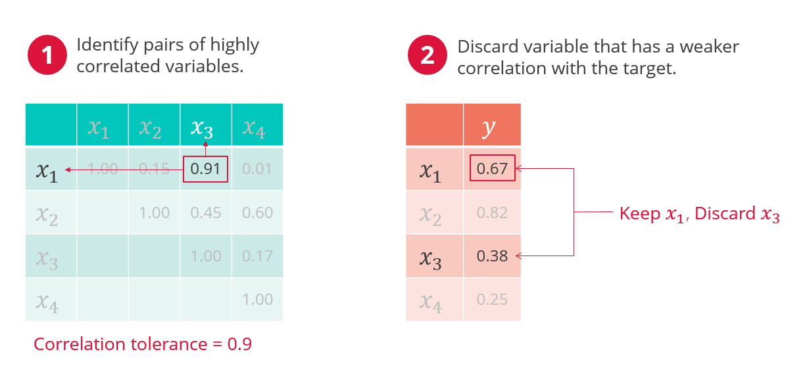

# Multi-Collinearity Reduction

This package can be used to remove features from your dataset in a way that helps reduce multi-collinearity.

## How to Use :rocket:

1. Import the `MultiCollinearity` class into your code:

	```
	from multicollinearity.feature_reduction import MultiCollinearity
	```

2. Initialize the class object:

	```
	mc = MultiCollinearity(df, target)
	```
The first argument must be the name of the `pandas` dataframe, and the second argument is the name of the target column in that dataframe.

Here are all parameters available in this class:

* `df`: Name of the pandas dataframe
* `y_col`: Name of the target column in the input dataframe
* `corr_plot`: If set to True, two correlation heatmaps will be created (default: False)
* `verbose`: Set to False if you don't want any information about which features are droped and why (default: True)

3. Perform some feature reduction based on pairwise correlations:

	```
	df_temp = mc.pairwise_corr()
	```

You can inspect the content of `df_temp`, which should have fewer columns if any fatures were dropped due to high correlation with another feature.

Here are all parameters available in this function:

* `min_vars_to_keep`: The default value is set to 10, which means that the feature reduction process will stop if the number of features that are left in the dataframe reaches this value. Change this value according to your requirements.
* `corr_tol`: This value is used to determine whether a pair of features are heavily correlated with each other or not. If the correlation value is higher than the threshold, they are considered highly correlated and one of them will be dropped. (default: .9)

4. Finally, perform further feature reduction based on multi-collinearity:

	```
	df_final = mc.multi_collin()
	```
The final dataframe will have the reduced set of features that you can then use for training a model.

Here are all parameters available in this function:

* `cond_index_tol`: The condition index threshold value. If the condition index is higher than this threshold, feature reduction will commence. The feature reduction process will stop if the condition index value reaches below this threshold. (defauld: 30)
* `min_vars_to_keep`: (Same as above.) The default value is set to 10, which means that the feature reduction process will stop if the number of features that are left in the dataframe reaches this value. Change this value according to your requirements.

## How it Works :gear:

> The original idea was presented (by yours truly) in PyData 2016. The [video](https://youtu.be/ioXKxulmwVQ?si=syt8UXPE0p41pT4w) is available online, but the sound quality is not very good.

The feature reduction is performed in two (sequential) steps:

1. Feature Reduction based on Pairwise Correlations

Consider the following example to understand how this works:
Two features, x<sub>1</sub> and x<sub>3</sub>, have an absolute correlation coefficient of .91. This value is higher than the threshold value of .90, so one of these two features will be dropped.

<p align='center'>
	
</p>

To decide which feature should be dropped, we look at their correlation with the target column. In the example above, x<sub>1</sub> has a higher correlation with the target, so it will be kept while x<sub>3</sub> will be dropped.

This process will continue until either the pairwise correlation threshold is reached or the minimun number of features (to keep) threshold is reached.

2. Feature Reduction based on Multi-Collinearity

First, eigenvalue decomposition is performed on the correlation matrix. There will be as many eigenvalues and eigenvectors calculated as the number of features. If multi-collinearity is present in the dataset, there will be at least one of these eigenvectors (aka directions) that is reduntant, i.e., it's not explaining any variance in the data. The redundant eigenvector can be identified by calculating **condition index** for each eigenvector. 

> Condition Index = (max(eigenvalue) / min(eigenvalue)) ** .5

The eigenvector with the highest condition index (above the threshold) is one of the culprits (to cause multi-collinearity in the data). We need to discard that particular direction. But since this is an eigenvector (and not a feature in the original dataframe), we can't remove it from the original dataframe. Instead, we will find out which feature has the highest factor loading on that eigenvector. We identify that feature that leans the heaviest on the eigenvector and discard it from the dataset. We repeat this process until one of the two criteria is met: `min_vars_to_keep` or `cond_index_tol`.

Consider the following example to understand how this works:

We identify u<sub>4</sub> as the redundant eigenvector. Now x<sub>3</sub> has the highest loading on that eigenvector, so we will discard x<sub>3</sub> and then iterate. 

<p align='center'>
	
</p>

> [!NOTE]
> Check out the [`example.ipynb`](./notebooks/example.ipynb) notebook in this repo which demonstrates the functionality of this package with the **Boston Housing** dataset.

## TODO :ballot_box_with_check:
1. Add test cases.
2. Make it possible to run this without the presence of the target variable, i.e., do this in an unsupervised way.

## SOURCE :book:

<p align='center'>
	[](https://a.co/d/7PyVHSZ)
</p>
